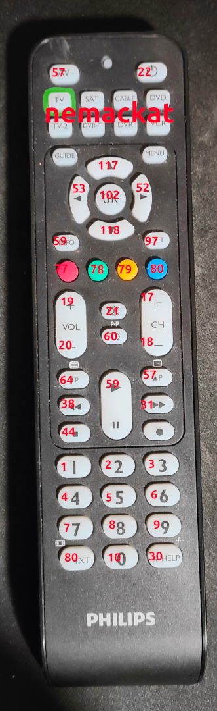

# Robokočka pro Zuzanku

## Funkce

### Ježdění

Implementováno jako diferenciální řízení. Ovládání pomocí šipek. Jede to, pokud se šipka drží, jinak zastaví.


PROBLEM. Nelze mačkat dve tlacitka zaroven, takze diff drive nedava smysl. Neslo by v jinem rezimu ovladace nez TV mackat dve sipky naraz?

### Servo / stmívání

Na trojpin D2 je možné připojit malé servo. To lze využít třeba na máchání ocasem, nebo jiný pohyb.

Servo lze ovládat na různé způsoby. 

Tlačítka 1 4 7 pro vertikální pohyb, kde 4 nastaví servo do střední polohy.

Tlačítka 2 5 8 pro vertikální pohyb, kde 5 nastaví servo do krajní polohy.

TBD 3 6 9

Tlačítka TXT 0 HELP pro horizontální pohyb, kde 0 nastaví servo do střední polohy.

Tlačítko zapnout (22) aktivuje pohyb serva D2 sem-tam.
Tlačítko zapnout (21) aktivuje pohyb serva D13 sem-tam.

Místo serva lze zapojit LED, která se bude stmívat pomocí PWM. Principiálně stejné jako u serv.




> Červená čisla jsou IR kódy pro programování Arduina.

> Pokud ovládání nereaguje, asi někdo zmáčkl tlačítka nemačkat. Spraví se to tlačítkem TV.

### On/Off

TBI


## Instalace

1. Instaluj Arduino IDE 2.x. Nakopiruj 'libraries' do $HOME/Arduino/libraries. 

2. ```git clone https://github.com/kubajznicek/robo_kocka.git```

3. Nastav board jako Arduino Mini Pro 8MHz.

4. Validuj, uploaduj. Je lepší mít baterku při uploadu zapnutou, i když návod tvrdí opak.


## Zaloha starých poznámek

jezdit
zatacet
servo 1 2 3 (pwm) - D1 D2 D3
led 1 2 3 (pwm) - D11 D12 D13
digitalni vstup 1 2 - D9 D10

rgb led
	barevne cudliky 77 - 80
	

59 speed ++
97 speed --

117 drive += speed
118 drive -= speed
	kdyz se to pusti tak drive = 0

52 turn += rspeed
53 turn -= rspeed
	kdyz se to pusti tak turn = 0


77 - 80 pwm D11 - D13 podle barvy

19, 17 vertikalni bez nuly +	D12 D13
20, 18 vertikalni bez nuly -

64, 38 horizontalni bez nuly -	D11 D12
57, 31 horizontalni bez nuly +

1, 2, 3 vertikalni s nulovanim + D1 D2 D3
4, 5, 6 vertikalni s nulovanim 0
7, 8, 9 vertikalni s nulovanim -

30 horizontalni s nulovanim + D1
10 horizontalni s nulovanim 0
80 horizontalni s nulovanim -

22, 21, 60, 44, 102 on/off D1 D2 D3 D11 D13 
